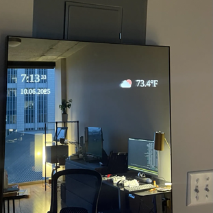

# Smart Mirror
Simple Qt 6 dashboard for my smart mirror build.



## Quickstart
Build the project using CMake.
```
git clone https://github.com/hunterwellis/qt-mirror.git
cd qt-mirror
mkdir build && cd build
cmake ..
make
./mirror  # run the software
```

Add API keys to a `.env` file in the base directory.
```
OPENWEATHER_API_KEY=XXXXXXXXXXXXXXXXXXXXXXXXXXXXXXXX
```

## Available Widgets
- Digital Clock
- Analog Clock
- Date
- Weather
- Google Calendar
- Habit Tracker

## Hardware
Much of the hardware inspiration came from [this repo](https://github.com/olm3ca/mirror).

## Requirements
- CMake
- Qt 6
- Qt 6 NetworkAuth

## TODO
1. Integrate solid state relay for high power electronics
1. RTC Sleep trigger
1. Finalize google calendar
1. Add custom wiring diagram
